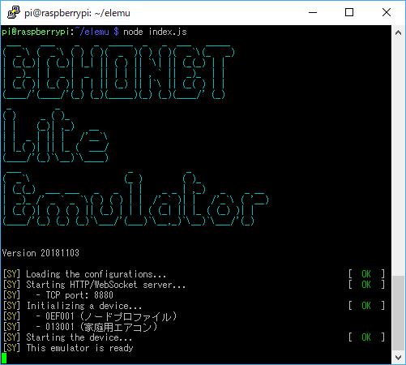
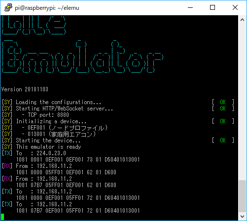
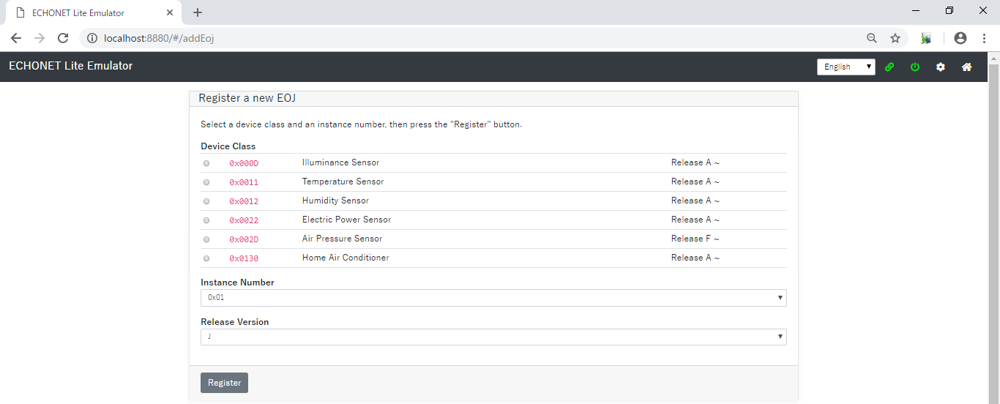
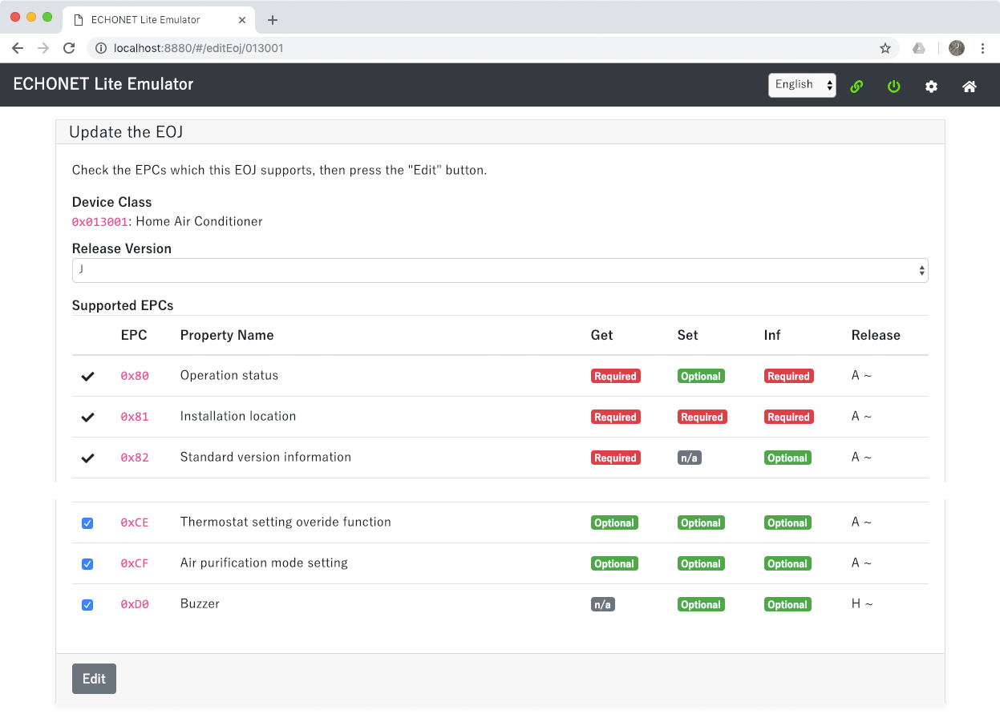

# ECHONET Lite Device Emulator User Manual

2021.09.13

(C) Kanagawa Institute of Technology, Smart House Research Center

---------------------------------------

## CONTENTS

* [Environment setup](#setup-environment)
* [Starting EL emulator](#startup-emulator)
* [Starting dashboard](#access-dashboard)
* [Header icons](#header-icons)
* [System configuration](#sys-conf)
* [Device object instances](#device-object-instances)
* [Packet sender](#packet-sender)
* [Packet monitor](#packet-monitor)
* [Controller](#controller)

---------------------------------------
## <a id="setup-environment">environment setup</a>

### Dependence

This emulator shall operate on the node.js. It depends on several node modules.

* [Node.js](https://nodejs.org/en/) v10 or higher
* [express](http://expressjs.com/)
* [ws](https://github.com/websockets/ws)

### OS update

Environment setting procedure is explained, having [Raspbian] on Raspberry Pi 3 Model B+ (https://www.raspberrypi.org/downloads/raspbian/) as an example. As stated below, update the Raspbian package beforehand.

```
$ sudo apt-get update
$ sudo apt-get dist-upgrade
$ sudo apt-get upgrade -y
$ sudo reboot
```

### Installing Node.js body

```
$ curl -sL https://deb.nodesource.com/setup_10.x | sudo -E bash -
$ sudo apt-get -y install nodejs
```

This completes the installation of the node main body. Execute the following commands and check if the version is displayed.

```
$ node -v
v10.0.0
```

### Installing the emulator

Copy the entire directory `elemu` from  this emulator to the home directory. You can copy it to anywhere.

### Installing Node modules

Install the node module that the emulator depends on.

```
$ cd ~/elemu
$ npm install
```

This completes installation of the emulator.

---------------------------------------
## <a id="startup-emulator">starting EL emulator</a>

Directory `elemu` of the EL emulator body shall be installed immediately below the `/home/pi`. The EL emulator shall be started as follows with `pi` user privileges: Any user can actually start the EL emulator; however, due to the writing process required for the files within `elemu`, only users who have copied the emulator directory `elemu`  may start the EL emulator.

```
$ cd ~/elemu
$ node index.js
```

After completion of startup, the following message will appear on the shell:



If you want to output the ECHONET Lite packet transmission status, startup can be done with a command switch option (see below).

```
$ node index.js --enable-console-packet
```

After completion of startup, the following message should be output on the console when this emulator transmits an ECHONET Lite packet.



---------------------------------------
## <a id="access-dashboard">dashboard</a>

Dashboard is provided as a Web app to operate on the Web browser. Accessing a host computer running the EL emulator using Web browser via port 8880 displays the dashboard. Access the following URL if accessing the dashboard from the browser opened on the computer that started this emulator.

```
http://localhost:8880
```

If the computer that started this emulator and the computer that displays the dashboard are different, the one that runs the emulator is Raspberry Pi and only one Raspberry Pi exists on the local network, and if the one displayed the dashboard supports Bonjour (mDNS/DNS-SD), then accessing through the URL is possible.

```
http://raspberrypi.local:8880
```

If access to the dashboard fails through the URL above, directly designate the IP address of the computer that runs the emulator.

```
http://192.168.11.3:8880
```

If access to the dashboard is successful, then the screen shown below will appear on the browser.


---------------------------------------
## <a id="header-icons">header icon</a>

The header of the dashboard has several icons. The meanings of the icons are as follows:


### Setting language

This dashboard supports Japanese and English. Selecting a language using the pull-down menu will automatically change the display to the selected language.


### WebSocket link icon


This icon shall indicate the WebSocket connection status between the dashboard and emulator. The icon is green if connected properly, and turns gray when disconnected. When the icon is gray, check if the emulator has started properly.

### Power button icon


The icon is green if the emulator has started. Clicking this icon can temporarily suspend the emulator. The icon is gray when suspended. Clicking the icon once again will start up the emulator, turning the icon green. 

Pressing this button can change the emulator status. However, this does not mean that the emulator process is shut down. Changing the emulator status simply means that emulator operation is suspended. Even if the emulator is turned off, its process is still ongoing. This means that the dashboard is still in use.

### Setting button


Pressing the button opens the setting screen of the emulator. For more details, see “[System configuration](#sys-conf)”.

### Home　button


Pressing the button when screens other than the Home screen are opened returns to the Home screen.

---------------------------------------
## <a id="sys-conf">System configuration</a>

In this screen, parameters to determine the operation of the emulator can be set. Although this screen does not normally require any change in a normal state, the settings should be changed if necessary.


There is Reset the System button at the bottom of the screen. Pressing the button resets the emulator to the initial state. Note that the system configuration parameters will not be initialized.

---------------------------------------
## <a id="device-object-instances">Device object instances</a>

The Device Object Instances area on the top screen shall manage devices to be emulated. By default, the node profile (EOJ:`0x0EF001`) and home air conditioner (EOJ:`0x013001`) are registered. 

Switching the device using the pull-down menu displays a list of corresponding device properties and their values underneath the device.


### Register a new EOJ

Pressing the Register a New EOJ button displays a screen to newly register devices to be emulated.



Select the device class, instance number, and release version to be added, and then press the Register button. The corresponding device shall be activated on the emulator upon completion of the registration.

### Reload

Pressing the Reload button on the side of the pull-down menu displays the latest property values once again. Property values may be changed if the emulator receives a SetC or SetI command from outside. This button is installed to allow users to check the latest property values.

### Edit

Pressing the Edit button next to the pull-down menu displays the edit screen of the corresponding devices.



On the Edit EOJ screen, release versions can be changed or properties to be supported can be selected. Note that mandatory properties cannot be canceled.

### Delete

Pressing the Delete button on the side of the pull-down menu displays a modal window to confirm the device deletion of the corresponding devices.


Pressing the OK button deletes the corresponding device from the emulator.

---------------------------------------
## <a id="packet-sender">packet sender</a>

The Send a Packet area on the top screen shall send an ECHONET Lite packet from the emulator.


First, select a destination IP address, then select the TID (automatically assigns numbers if not designated), SEOJ, DEOJ, ESV, and OPC. Selecting an OPC increases or decreases the EPC designation column according to the designated number.

The EPC pull-down menu dynamically changes its contents according to the SEOJ and DEOJ selected. Designate a hexadecimal character string in the EDT input column. Do not place `0x` at the beginning.


When the EPC is selected, the icon (i) appears in the beginning of the EDT input column. When this icon is clicked, the corresponding EPC Device Description information pops up. Designate EDT while referring to this information.


## <a id="packet-monitor">packet monitor</a>


The Packet Monitor area on the top　screen shall show the list of the ECHONET Lite packets transmitted by this emulator. Newly transmitted packets shall be added to the bottom of the list and the list shall automatically scroll to down to show the latest packet.

Clicking one of the items in the packet list displays the analysis results for the packet underneath the list.

Clicking the trash box icon placed on the right edge of the packet list bar clears the packet list.

---------------------------------------
## <a id="controller">controller</a>

This emulator can also operate as a controller. To use this emulator as a controller, temporarily delete all the devices except the node profile from the Device Object Instances. Then add a “Controller” on the “Register a new EOJ” screen. When using the emulator as a controller, note that it cannot coexist with devices other than the node profile.

If any controller is added, a new Remote Device area is added to the Home screen.


Pressing the Device Search button multicasts a device search packet. The newly found devices shall be added to the list automatically.

Clicking the List icon of the listed device displays the Details of Remote Devices screen.


Devices found by the emulator are currently listed from the pull-down menu on the upper part of this screen. At this moment, the remote device to be displayed can be switched.

Pressing the Get All Property Data button “gets” all available property values to the corresponding remote devices and displays the results.

Clicking download icon in each of the property line “gets” only corresponding property values to the corresponding remote devices and displays the results.
